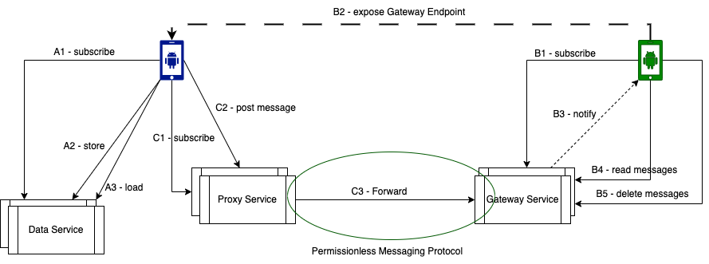

# didcomm-mediator-rs

A DIDComm mediator is a cloud agent that relays and routes messages between mobile agents. It is an essential component in the self-sovereign identity (SSI) ecosystem because it allows mobile agents to communicate with each other without being tied to centralized cloud infrastructures like Facebook, Signal, or Telegram. Unfortunately, mobile phones are not first-class citizens in web-based interactions. Therefore, messages sent by a mobile agent to another one must be routed and/or relayed through some sort of cloud agents, which are always available for web interaction (first-class citizen).

DIDComm mediators work by storing the DIDs (decentralized identifiers) of mobile agents. When a mobile agent wants to send a message to another mobile agent, it sends the message to the DIDComm mediator. The mediator then routes the message to the recipient's DIDComm mediator. The recipient's DIDComm mediator then delivers the message to the recipient's mobile agent.

The following diagram displays some cloud services that can be provided by a DIDComm mediator. In particular, services that take care of routing and relaying messages among mobile agents.

Even though both (proxy and gateway) functionalities are specified in the same component in the DIDComm ecosystem, it is important to distinguish between the proxy and the gateway service. This distinction is made in the same way as the distinction between an SMTP server (which sends out emails) and an IMAP server (which delivers emails).

The data service can be considered a vital service to be provided to a mobile agent. Even though it is not fully aligned with the DIDComm messaging specification, displaying a data service here is essential so that we can see all the functionalities needed by a mobile agent to be complete.

Subscriptions will ensure a certain trust relationship between mobile agents and cloud services, and thereby serve as the foundation of the economic model on top of which cloud services are built.

A standardization of these cloud agents, in the same way email protocols were standardized, is essential for the success of the decentralized web.

## Self-Sovereign Identity (SSI)

* Self-Sovereign Identity (SSI) is a way for individuals to control their own digital identities.
* SSI uses decentralized identifiers (DIDs) and verifiable credentials (VCs) to allow individuals to share their identity information with others in a secure and privacy-preserving way.
* SSI has the potential to revolutionize the way that we interact with the internet, making it more secure, private, and user-centric.

## DIDComm Messaging
The DIDComm messaging specification can be found [here](https://identity.foundation/didcomm-messaging/spec/)

### Functionaly
* DIDComm is a messaging methodology that works with the decentralized identifier (DID) core spec to provide private, secure interaction between parties.
* DIDComm messaging is designed to be flexible and extensible, allowing for new protocols and applications to be built on top of it.
* The DIDComm specification is currently under development, but it has already been adopted by a number of projects, including the W3C Verifiable Credentials Working Group.
* DIDComm is a promising technology with the potential to revolutionize the way that we interact with the internet.

### Technicaly
* DIDComm messages are structured as JSON objects, and they can be exchanged over a variety of channels, including HTTP, WebSockets, and SMS.
* DIDComm messages can be used to send a variety of data, including requests, responses, notifications, and events.
* DIDComm messages are signed using the DID method, which ensures that they are tamper-proof and can be verified by the recipient.
* DIDComm is a secure and privacy-preserving messaging methodology that has the potential to be used in a wide variety of applications.

