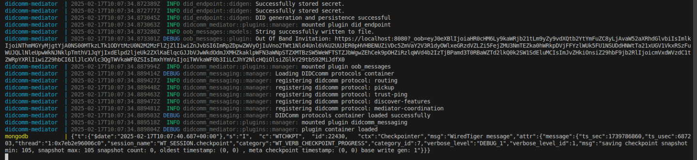

[](https://github.com/adorsys/didcomm-mediator-rs/actions/workflows/rust.yml)
[](https://github.com/adorsys/didcomm-messaging-clients-utilities)
[](https://identity.foundation/didcomm-messaging/spec/)
[](https://github.com/adorsys/didcomm-mediator-rs/blob/main/LICENSE)


# DIDComm-Mediator

A DIDComm mediator is a cloud agent that facilitates secure, decentralized communication between mobile agents in the self-sovereign identity (SSI) ecosystem. This mediator acts as a cloud-based intermediary, enabling mobile agents to communicate without reliance on centralized infrastructures like Facebook, Signal, or Telegram.


For further understanding checkout the [docs](docs/mediator-doc.md)<br>

###  Project Feature Implementation Tracker

|Message types  | Spec Status | Implementation Status|
|---------------|-------------|----------------------|
|[Mediator Coordination Protocol](https://didcomm.org/coordinate-mediation/2.0/)| ADOPTED| ✅|
|[Pickup Protocol](https://didcomm.org/messagepickup/3.0/)| ADOPTED | ✅ |
|[DID Rotation](https://didcomm.org/book/v2/didrotation) | ACCEPTED | ✅ |
|[Cross-Domain Messaging/ Routing Protocol](https://identity.foundation/didcomm-messaging/spec/#routing-protocol-20) | ADOPTED | ✅|
|[Trust Ping Ptotocol](https://identity.foundation/didcomm-messaging/spec/#trust-ping-protocol-20) | ADOPTED|✅|
|[Discover Features Protocol](https://didcomm.org/discover-features/2.0/) | ADOPTED | ✅ |
|[Out of band Messaging](https://identity.foundation/didcomm-messaging/spec/#out-of-band-messages) | ADOPTED | ✅
|[Basic Message Protocol](https://didcomm.org/basicmessage/2.0/#:~:text=The%20BasicMessage%20protocol%20describes%20a,message%20type%20used%20to%20communicate.) | ADOPTED|⚪|
|[Acks](https://github.com/hyperledger/aries-rfcs/tree/main/features/0015-acks)| ADOPTED |❌ |
|[Present Proof Protocol](https://didcomm.org/present-proof/3.0/)| ADOPTED | ❌|

## Building and testing

To build and test the project, ensure that **libssl-dev** and **pkg-config** are installed on your system.

### Ubuntu Setup

Install the necessary packages with:

```sh
sudo apt update
sudo apt install -y libssl-dev pkg-config
```

### Prerequisites

Ensure you have [Rust & Cargo](https://www.rust-lang.org/tools/install) installed.

## Setup

1. Optionally, create a working directory and navigate into it.

2. Clone the repository:

```sh
git clone git@github.com:adorsys/didcomm-mediator-rs.git
```

## Running the Project

To build and run the project:

* First you need to do a

```sh
docker-compose up
```

* This command will pull the docker image of the mediator with all it's prerequisite.


The output should look like this:



* Run the Mediator
```sh
docker compose up --build
```

### Testing

The tests can be run with:

```sh
cargo test --workspace
```

or optionally with `cargo nextest` (you may want to [install](https://nexte.st/docs/installation/pre-built-binaries/) it first) if you want to speed-up the tests:

```sh
cargo nextest run --workspace
```

## Troubleshooting

* **Build Errors**: Verify the required packages (**libssl-dev** and **pkg-config**) are installed, and you have the latest Rust and Cargo versions.
* Use `cargo check` to identify missing dependencies:

```sh
cargo check
```

## License

This project is licensed under the Apache License. See the [LICENSE](https://github.com/adorsys/didcomm-mediator-rs/blob/main/LICENSE) file for details.
