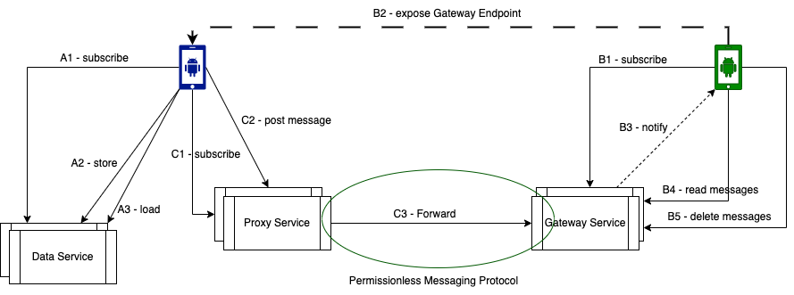

[](https://github.com/adorsys/didcomm-mediator-rs/actions/workflows/rust.yml)

[](https://github.com/adorsys/didcomm-mediator-rs/blob/main/LICENSE)


# Didcomm-mediator

A DIDComm mediator is a cloud agent that facilitate secure, decentralized communication between mobile agents in the self-sovereign identity (SSI) ecosystem. This mediator acts as a cloud-based intermediary, enabling mobile agents to communicate without reliance on centralized infrastructures like Facebook, Signal, or Telegram.

## Overview

### Why a DIDComm Mediator?

Mobile phones are not naturally suited for web-based interactions. To overcome this limitation, messages sent between mobile agents are routed through a DIDComm mediator, a cloud agent that ensures reliable delivery by always being available for web interactions.

### How It Works

A DIDComm mediator stores the Decentralized Identifiers (DIDs) of mobile agents. When one mobile agent sends a message to another, it first sends the message to a DIDComm mediator. This mediator routes the message to the recipient’s mediator, which then delivers the message to the intended recipient.

The following diagram displays some cloud services that can be provided by a DIDComm mediator. In particular, services that take care of routing and relaying messages among mobile agents.



**Key Services Provided:**

* **Routing**: Ensures messages are correctly forwarded to the intended recipients.
* **Relaying**: Acts as an intermediary for messages between agents.
* **Proxy Service**: Similar to an SMTP server, it handles message sending.
* **Gateway Service**: Analogous to an IMAP server, it manages message delivery.

**Data Service**: Although not part of the core DIDComm specifications, it’s a vital service that ensures mobile agents have the necessary support for comprehensive functionality.

**Subscriptions**: Ensures trusted relationships between mobile agents and cloud services, and thereby serve as the foundation of the economic model on top of which cloud services are built.

### The Importance of Standardization

Standardizing these cloud agents is essential for the decentralized web's success, much like the standardization of email protocols.

## Self-Sovereign Identity (SSI)

* **Self-Sovereign Identity (SSI)**: Empowers individuals to control their own digital identities without relying on centralized authorities.
* **Decentralized Identifiers (DIDs) and Verifiable Credentials (VCs)**: The backbone of SSI, allowing secure, privacy-preserving sharing of identity information.
* **Revolutionary Potential**: SSI has the potential to revolutionize the way that we interact with the internet, making them more secure, private, and user-centric.

## DIDComm Messaging

**DIDComm** is a messaging protocol that works with DIDs to provide secure, private communication between parties. The full specification is available [here](https://identity.foundation/didcomm-messaging/spec/).

### Functional Aspects

* **Flexibility**: DIDComm messaging is designed to allow new protocols and applications to be built on top of it.
* **Adoption**: Already adopted by several projects, including the W3C Verifiable Credentials Working Group.

### Technical Aspects

* **Structure**: DIDComm messages are JSON objects, transferable over channels like HTTP, WebSockets, and SMS.
* **Usability**: DIDComm messages can be used to send a variety of data, including requests, responses, notifications, and events.
* **Security**: Messages are signed using the DID method, ensuring tamper-proof, verifiable communication.

## Building and testing

To build and test the project, ensure that **libssl-dev** and **pkg-config** are installed on your system.

### Ubuntu Setup

Install the necessary packages with:

```sh
sudo apt update
sudo apt install -y libssl-dev pkg-config
```

### Prerequisites

Ensure you have [Rust & Cargo](https://www.rust-lang.org/tools/install) installed.

## Setup

1. Optionally, create a working directory and navigate into it.

2. Clone the repository:

```sh
git clone git@github.com:adorsys/didcomm-mediator-rs.git
```

## Running the Project

To build and run the project:

* Compile the project:

```sh
cargo build
```

* Start the mediator service:

```sh
cargo run
```

The output should look like this:


### Testing

The tests can be run with:

```sh
cargo test --workspace
```

or optionally with `cargo nextest` (you may want to [install](https://nexte.st/docs/installation/pre-built-binaries/) it first) if you want to speed-up the tests:

```sh
cargo nextest run --workspace
```

## Troubleshooting

* **Build Errors**: Verify the required packages (**libssl-dev** and **pkg-config**) are installed, and you have the latest Rust and Cargo versions.
* Use `cargo check` to identify missing dependencies:

```sh
cargo check
```

## License

This project is licensed under the MIT License. See the [LICENSE](LICENSE) file for details.
