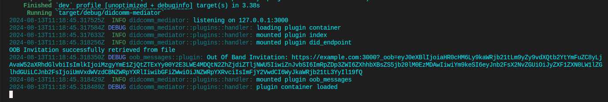

[](https://github.com/adorsys/didcomm-mediator-rs/actions/workflows/rust.yml)

[](https://github.com/adorsys/didcomm-messaging-clients-utilities)


[](https://identity.foundation/didcomm-messaging/spec/)


[](https://github.com/adorsys/didcomm-mediator-rs/blob/main/LICENSE)


# Didcomm-mediator

A DIDComm mediator is a cloud agent that facilitate secure, decentralized communication between mobile agents in the self-sovereign identity (SSI) ecosystem. This mediator acts as a cloud-based intermediary, enabling mobile agents to communicate without reliance on centralized infrastructures like Facebook, Signal, or Telegram.


## Building and testing

To build and test the project, ensure that **libssl-dev** and **pkg-config** are installed on your system.

### Ubuntu Setup

Install the necessary packages with:

```sh
sudo apt update
sudo apt install -y libssl-dev pkg-config
```

### Prerequisites

Ensure you have [Rust & Cargo](https://www.rust-lang.org/tools/install) installed.

## Setup

1. Optionally, create a working directory and navigate into it.

2. Clone the repository:

```sh
git clone git@github.com:adorsys/didcomm-mediator-rs.git
```

## Running the Project

To build and run the project:

* Compile the project:

```sh
cargo build
```

* Start the mediator service:

```sh
cargo run
```

The output should look like this:



### Testing

The tests can be run with:

```sh
cargo test --workspace
```

or optionally with `cargo nextest` (you may want to [install](https://nexte.st/docs/installation/pre-built-binaries/) it first) if you want to speed-up the tests:

```sh
cargo nextest run --workspace
```

## Troubleshooting

* **Build Errors**: Verify the required packages (**libssl-dev** and **pkg-config**) are installed, and you have the latest Rust and Cargo versions.
* Use `cargo check` to identify missing dependencies:

```sh
cargo check
```

## License

This project is licensed under the Apache License. See the [LICENSE](https://github.com/adorsys/didcomm-mediator-rs/blob/main/LICENSE) file for details.
