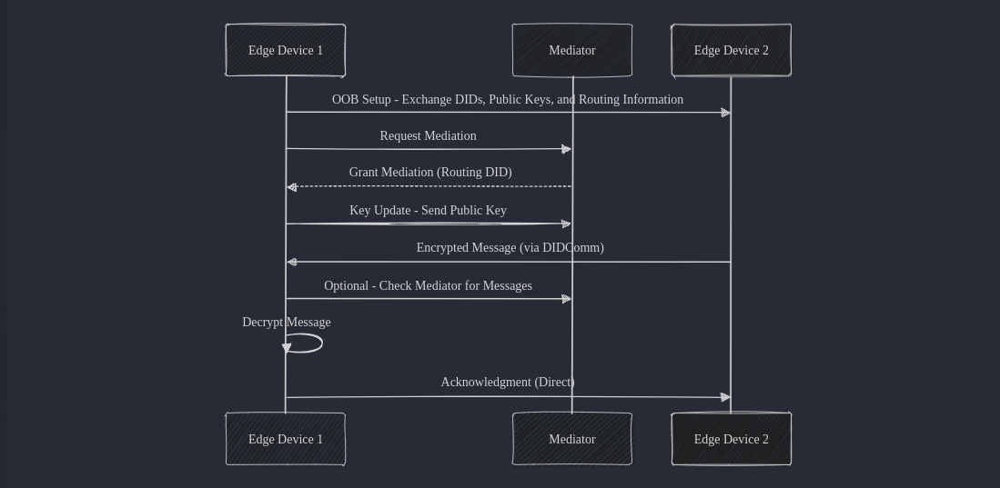

# DIDComm Mediator Architecture Document

### **Table of Contents**
- [**DIDComm Mediator Architecture Document**](#didcomm-mediator-architecture-document)
- [**Table of Contents**](#table-of-contents)
- [**1. Introduction**](#1-introduction)
    - [**1.1 Purpose**](#11-purpose)
    - [**1.2 System Overview**](#12-system-overview)
    - [**1.3 Quality Goals**](#13-quality-goals)
    - [**1.4 Stakeholders**](#14-stakeholders)
- [**2. Constraints**](#2-constraints)
- [**3. System Scope and Context**](#3-system-scope-and-context)
    - [**3.1 Business Context**](#31-business-context)
    - [**3.2 Technical Context**](#32-technical-context)
- [**4. Solution Strategy**](#4-solution-strategy)
- [**5. Building Block View**](#5-building-block-view)
- [**6. Runtime View**](#6-runtime-view)
- [**7. Deployment View**](#7-deployment-view)
- [**8. Cross Cutting Concerns**](#8-cross-cutting-concerns)
- [**9. Architectural Decisions**](#9-architectural-decisions)
- [**10. Quality Requirements**](#10-quality-requirements)
- [**11. Risk and Technical Debt**](#11-risk-and-technical-debt)
- [**12. Glossary**](#12-glossary)

## 1. Introduction
### 1.1 Purpose
This document provides a detailed architecture for the DIDComm Mediator, a system designed to mediate communication between decentralized identities (DIDs) using the DIDComm protocol. The document outlines the design decisions, components, and interactions in the system.

### 1.2 System Overview
The DIDComm Mediator acts as an intermediary that forwards messages between decentralized identifiers (DIDs) while maintaining security, privacy, and scalability. It adheres to the DIDComm messaging protocol, enabling seamless communication between agents.

### 1.3 Quality Goals
- ***Security***: End-to-End encryption and authentication.
- ***Scalability***: Handle high message volume efficiently.
- ***Reliability***: Ensure fault tolerance and high availability
- ***Extensibility***: Support future enhancements and additional DID methods

### 1.4 Stakeholders
Key stakeholders include DATEV, the adorsys development team, and third-party developers

# 2. Constraints
- The project will be implemented in rust so as to take advantage of it's performance and safety features
- Only asynchronous Rust frameworks like tokio, axum, hyper, tracing can be used to ensure non-blocking operations
- The project must adhere to DIDComm V2 specifications

# 3. System Scope and Context
### 3.1 Business Context
The DIDComm Mediator acts as a bridge to enable seemless communication between decentralized agents, ensuring secure and reliable message routing.

### 3.2 Technical Context

# 4. Solution Strategy
The solution strategy outlines the foundational decisions that guide the system's architecture, aligning with the key quality goals, constraints, and overall system requirements.

**Technology Decisions**
- **Programming Language**: Rust is chosen for its high performance, memory safety, and strong concurrency support. This decision aligns with the security and scalability goals of the mediator.
- **Cryptographic Libraries:** Askar is selected as the cryptographic library to provide high-level cryptographic functions specifically designed for decentralized identity systems. Askar offers key management, encryption, and decryption capabilities that are essential for DIDComm communication. Its focus on modularity and interoperability with other decentralized identity (DID) systems ensures that the system can evolve and stay secure over time.
- **Database:** MongoDB is selected as the database for its flexibility in handling semi-structured data, scalability, and ease of horizontal scaling. It is ideal for storing DID-related metadata, messages, and other data in a schema-less format that can adapt as the system evolves.

# 5. Building Block View

# 6. Runtime View

# 7. Deployment View

# 8. Cross Cutting Concerns

# 9. Architectural Decisions

# 10. Quality Requirements

# 11. Risk and Technical Debt

# 12. Glossary
- ***DID(Decentralized Identifier):*** A unique identifier that enables verifiable, self-sovereign identities
- ***DIDComm:*** A secure messaging protocol used to communicate over decentralized networks
- ***Mediator:*** An intermediary service that routes DIDComm messages between agents
