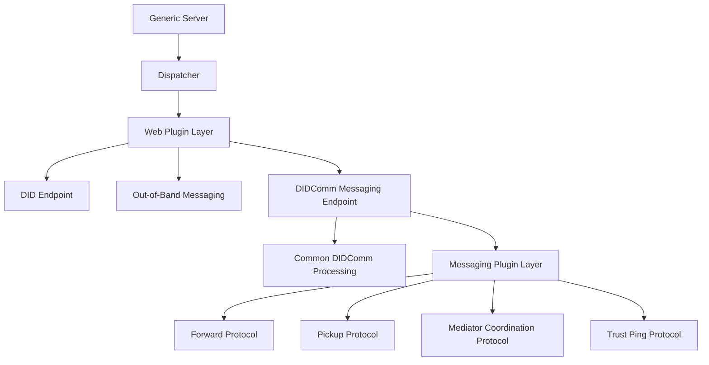
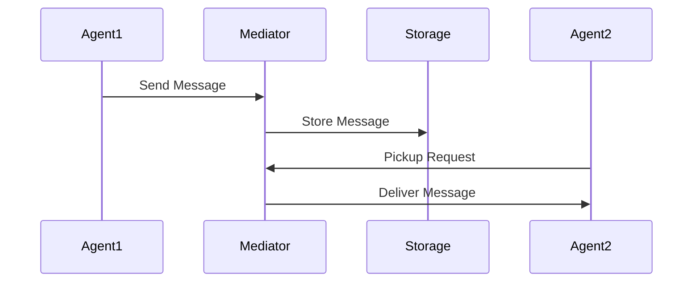
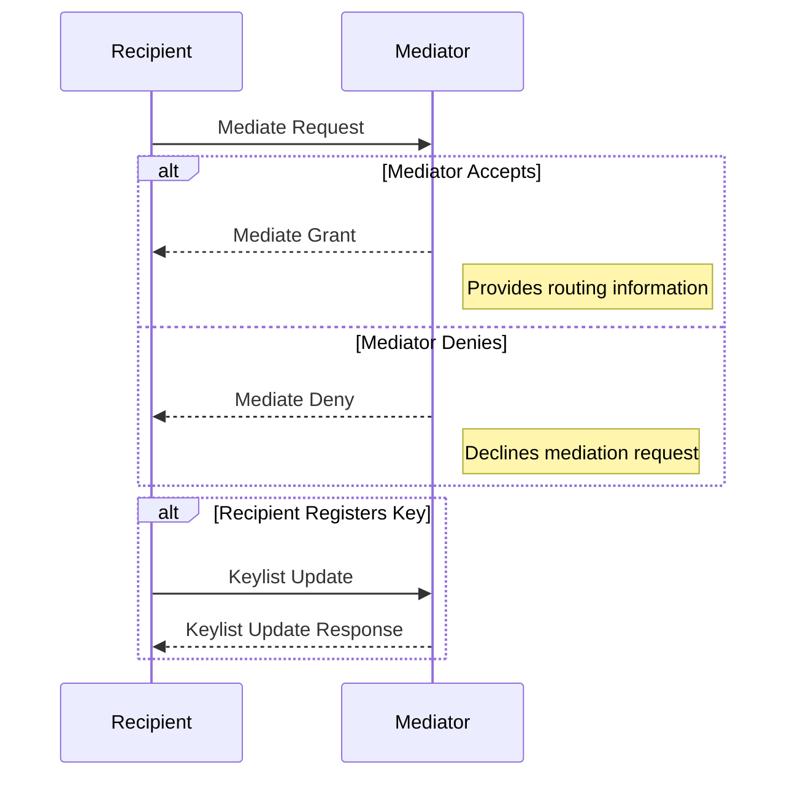
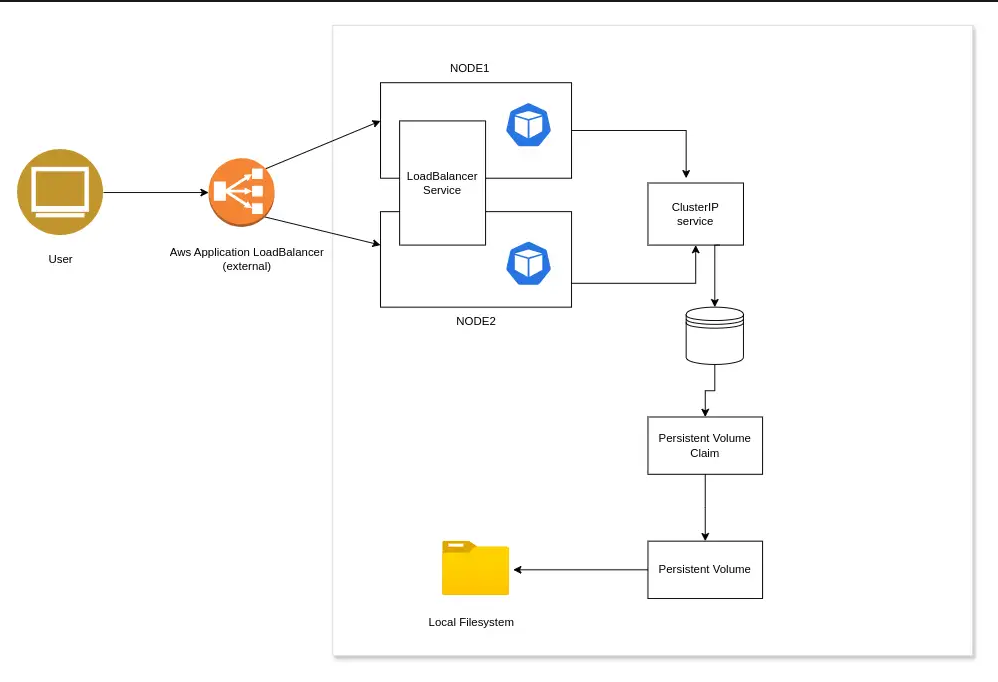

# DIDComm Mediator Architecture Documentation

## Table of Contents
1. [Introduction](#1-introduction)
2. [Architecture Constraints](#2-architecture-constraints)
3. [System Scope and Context](#3-system-scope-and-context)
4. [Solution Strategy](#4-solution-strategy)
5. [Building Block View](#5-building-block-view)
6. [Runtime View](#6-runtime-view)
7. [Deployment View](#7-deployment-view)
8. [Cross-cutting Concepts](#8-cross-cutting-concepts)
9. [Architecture Decisions](#9-architecture-decisions)
10. [Quality Requirements](#10-quality-requirements)
11. [Risks and Technical Debt](#11-risks-and-technical-debt)
12. [Glossary](#12-glossary)

---

## 1. Introduction
### 1.1 Document Goals
This document outlines the architecture of didcomm-mediator-rs, a Rust-based implementation of a DIDComm v2 mediator. The primary purpose of this mediator is to enable secure, efficient, and reliable routing of DIDComm messages, acting as a critical component in decentralized identity communication. This document serves as a comprehensive guide for stakeholders, architects, and developers, providing the necessary clarity for implementation, integration, and ongoing support of the system.

### 1.2 Stakeholders
- **Product Owners**: Define feature requirements.
- **Developers**: Build and maintain the mediator.
- **Operations Team**: Deploy and monitor the mediator in production.
- **Compliance Teams**: Ensure adherence to privacy and security regulations.
- **DIDComm Users**: End-users leveraging decentralized identity systems.

---

## 2. Architecture Constraints

### 2.1 Technical Constraints
- **Rust Programming Language**: Ensures high performance and memory safety.
- **Transport Agnosticism**: Supports HTTP
- **No External State**: Minimal reliance on external systems for scalability.

### 2.2 Regulatory Constraints
- **Privacy Compliance**: Aligns with GDPR and similar regulations.
- **Decentralized Design**: Eliminates central authority dependencies.

---

## 3. System Scope and Context

### 3.1 Business Context
The mediator facilitates routing of DIDComm messages for agents unable to maintain direct communication channels. It acts as an intermediary, ensuring reliability and privacy.

### 3.2 External Components
- **DIDComm Agents**: Sending and receiving agents.
- **Transport Protocols**: Various transport layers, e.g., HTTP or WebSockets.
- **Cloud Infrastructure**: For scalable and fault-tolerant deployments.

### 3.3 Component Diagram

---

## 4. Solution Strategy
A microservices approach ensures modularity and scalability. `didcomm-mediator-rs` employs Rust's async capabilities to handle concurrent message routing efficiently.

### Key Features:
The `didcomm-mediator-rs` project implements several essential protocols in the DIDComm v2 ecosystem, as outlined below:

| **Feature**                             | **Specification Status** | 
|-----------------------------------------|---------------------------|
| **Mediator Coordination Protocol**      | Adopted                  | 
| **Pickup Protocol**                     | Adopted                  | 
| **DID Rotation**                        | Accepted                 |
| **Cross-Domain Messaging/Routing Protocol** | Adopted                  | 
| **Trust Ping Protocol**                 | Adopted                  | 
| **Discover Features Protocol**          | Adopted                  | 
| **Out-of-Band Messaging**               | Adopted                  | 
| **Basic Message Protocol**              | Adopted                  | 
| **Acknowledgments (Acks)**              | Adopted                  | 
| **Present Proof Protocol**              | Adopted                  | 

---

## 5. Building Block View

### 5.1 Overview

The `didcomm-mediator-rs` project utilizes a plugin-based architecture, allowing modular and extensible implementation of DIDComm messaging protocols. The architecture is divided into two key plugin layers:

1. **Web Plugin Layer**: 
   - Enables plug-and-play of web endpoints.
   - Currently used to implement features such as **DID Endpoints**, **out-of-band messaging**, and **DIDComm messaging**.

2. **DIDComm Messaging Plugin Layer**:
   - Facilitates incremental addition of DIDComm sub-protocols.
   - Modular implementation ensures support for future protocols without major refactoring.

### 5.2 Detailed View

#### Top-Level Architecture

At the core is the *Mediator Server**, responsible for hosting the overall application and enabling the plugin system. The main components are:

1. **Dispatcher**: Routes incoming requests to the appropriate web plugin.
2. **Web Plugin Layer**: Hosts modular implementations for endpoint-specific logic (e.g., DID endpoint generation, out-of-band messaging).
3. **Common DIDComm Processing**: Handles general DIDComm request/response processing applicable across sub-protocols.

#### DIDComm Messaging Plugin Layer

Nested within the DIDComm Messaging endpoint is another plugin system for managing sub-protocols. This includes:

1. **Forward Protocol**: Handles message routing across agents.
2. **Pickup Protocol**: Manages message retrieval by offline agents.
3. **Mediator Coordination Protocol**: Supports agent registration and mediation setup.
4. **Plugin Utilities**: Shared utilities that facilitate sub-protocol implementations.

### 5.3 Building Block Diagram

The following diagram illustrates the layered architecture with the plugin-based system:

---

### 5.4 Key Advantages of Plugin Architecture

1. **Modularity**: Each protocol or feature can be independently developed, tested, and deployed.
2. **Extensibility**: New protocols or endpoints can be added without significant architectural changes.
3. **Scalability**: Lightweight plugins ensure efficient handling of additional features and traffic.

---

## 6. Runtime View

### 6.1 Message Flow
1. Agent sends a message to the mediator.
2. Mediator stores or forwards the message based on the recipient's status.
3. Recipient retrieves the message via the pickup protocol.

### Sequence Diagram

### 6.2 Mediator Coordination Flow
The Mediation Coordination Protocol is a component of the DIDComm framework, facilitating secure and efficient message routing between agents. It enables a recipient agent to request a mediator agent to handle message forwarding on its behalf. 

**Sequence Diagram: Mediation Coordination Protocol**

**Illustration: Runtime Interaction**

1. **Mediate Request**: The recipient sends a `mediate-request` message to the mediator, initiating the mediation process.

2. **Mediator's Response**:
   - **Grant**: If the mediator agrees, it responds with a `mediate-grant` message, providing necessary routing details.
   - **Deny**: If the mediator declines, it sends a `mediate-deny` message.

3. **Key Registration**: Upon receiving a grant, the recipient registers its keys with the mediator using a `keylist-update` message. The mediator acknowledges with a `keylist-update-response`.

This interaction ensures that messages intended for the recipient are appropriately routed through the mediator, enhancing communication reliability and security.  

### 6.3 Pickup Protocol
The pickup process allows agents to retrieve messages stored by the mediator. The mediator securely holds messages on behalf of the recipient agents, ensuring their safe and timely retrieval. This process is essential to ensuring reliable message delivery, even when the recipient agent is temporarily unavailable.

1. **Message Storage**
When a message is sent to an agent that is not immediately available to receive it, the mediator stores the message. The message remains encrypted using DIDComm standards to ensure that only the intended recipient can decrypt and read the content. Key aspects include:

- Encrypted Storage: Messages are stored in an encrypted format, ensuring the mediator has no access to the content.
- Indexed Storage: Messages are indexed based on the recipient's DID to facilitate efficient lookup and retrieval.

2. **Pickup Request**
The recipient agent initiates the pickup process by sending a pickup request to the mediator. The request must be signed with the agent’s private key to ensure authenticity and prevent unauthorized access. The pickup request contains:

- Recipient DID: To identify which messages are being retrieved.
- Authentication Signature: A cryptographic signature to validate the agent’s identity and access rights.

---

## 7. Deployment View

### 7.1 Deployment Strategy

The deployment of the `didcomm-mediator-rs` project leverages a scalable, distributed architecture designed for high availability, fault tolerance, and efficient message routing.

---

### 7.2 Deployment Model

#### 1. Distributed Deployment with Load Balancer 

**Use Case**: Ideal for production environments requiring high availability and scalability.

- Multiple mediator instances are deployed behind a load balancer.
- The load balancer distributes requests evenly across mediators, ensuring efficient utilization of resources.
- Supports horizontal scaling by adding more mediator instances as needed.

**Advantages**:
- High availability: If one mediator instance fails, others continue handling requests.
- Scalable: New instances can be added to handle increased load.
- Efficient routing: Load balancer optimizes resource utilization.

**Disadvantages**:
- Slightly higher complexity due to additional components (load balancer).

---

### 7.3 Deployment Diagram

Below is a component diagram showcasing the deployment with multiple mediators and a load balancer:

---

### 7.4 Deployment Considerations

#### **Cloud Deployment**

**Infrastructure**: 
- Use cloud platforms like AWS, Azure, or GCP.
- Services like Elastic Load Balancer (AWS), Application Gateway (Azure), or Cloud Load Balancer (GCP) can be employed for load balancing.

**Scaling**:
- Leverage auto-scaling groups to dynamically scale mediator instances based on traffic.

**Monitoring**:
- Use monitoring tools (e.g., Prometheus, CloudWatch, or Azure Monitor) to track mediator performance, error rates, and resource usage.

---

#### **On-Premises Deployment**

**Infrastructure**:
- Deploy mediators on virtual machines or containers (e.g., Docker).
- Use a software-based load balancer (e.g., HAProxy, NGINX) for request distribution.

**Scaling**:
- Add more mediator instances manually to handle increased traffic.

**Monitoring**:
- Use tools like Grafana and Prometheus to monitor system health.

---

### 7.5 Benefits of Load Balancer in Deployment

1. **Fault Tolerance**:
   - Ensures service continuity even if one mediator instance fails.

2. **Scalability**:
   - Handles growing traffic by distributing load across multiple instances.

3. **Optimized Resource Utilization**:
   - Prevents overloading a single mediator, ensuring consistent performance.

4. **Simplified Maintenance**:
   - Instances can be updated or replaced without downtime by redirecting traffic.

This detailed deployment view provides clarity on how the system can be deployed effectively, balancing performance, fault tolerance, and scalability.

---

## 8. Cross-cutting Concepts

### 8.1 Security

The security of `didcomm-mediator-rs` integrates both **application-level security** and **secure software development lifecycle (SSDLC) practices** to ensure robust, private, and resilient operations against potential vulnerabilities and attacks.

---

#### 8.1.1 End-to-End Encryption

DIDComm itself provides robust end-to-end encryption, ensuring that the mediator operates without access to message contents.

- **Encryption in Transit**: Messages are encrypted using DIDComm standards, safeguarding confidentiality during routing.
- **Confidentiality**: Only the intended recipient can decrypt and access the message content, ensuring data remains private.

---

#### 8.1.2 Authentication and Agent Identity Verification

Authentication ensures that only legitimate agents interact with the mediator, preventing unauthorized access and spam.

1. **Authentication During Mediation Coordination**:
   - Agents requesting mediation must authenticate using:
     - **DID Authentication**: Validates that the DID corresponds to the public key.
     - **Signed Credentials**: Ensures requests are cryptographically signed and verifiable.
     - **Trust Frameworks**: Optional integration with registries or decentralized credentials to validate agents.

2. **Anti-Spam Measures**:
   - **Rate Limiting**: Restricts the number of requests per agent within a given period.
   - **Credential Validation**: Verifies agent credentials or DID associations.
   - **Reputation Scoring**: Maintains agent reputation based on past behaviors.

---

#### 8.1.3 Authorization for Message Handling

The mediator enforces strict access controls to ensure only authorized agents can send and retrieve messages.

1. **Message Sending**:
   - Sender validation ensures:
     - The sender provides a cryptographically signed request.
     - The recipient's DID document lists the mediator as a valid routing endpoint.
     - Access control policies allow communication between the sender and recipient.

2. **Message Pickup**:
   - Before delivering stored messages, the mediator ensures:
     - The requesting agent provides a signed pickup request.
     - The private key used for signing matches the public DID associated with the mediator.

---

#### 8.1.4 Secure Storage and Key Management

Protecting private keys and sensitive data is paramount.

- **Encryption at Rest**: Private keys and secrets are encrypted using secure algorithms.
- **Memory Protections**: Runtime mechanisms prevent sensitive data from being swapped to disk.
- **Key Management**:
  - Secure storage mechanisms like HashiCorp Vault or AWS KMS are used.
  - Keys are rotated periodically to minimize risks.

---

#### 8.1.5 Traffic Control and Anti-Spam Measures

To ensure efficient operation and prevent abuse:
- **Rate Limiting and Throttling**: Prevents overloading by limiting agent requests.
- **Reputation-Based Blocking**: Blocks agents with poor reputations based on spam or malicious activity.
- **Audit Trails**: Logs all requests for later analysis and forensic investigation.

---

#### 8.1.6 Secure Logging and Monitoring

**Log Handling**:
- Sensitive data (e.g., private keys, Personally Identifiable Information) is redacted from logs.
- Logs are encrypted at rest and in transit.
- Access to logs is restricted to authorized personnel.

**Monitoring**:
- Tools like Prometheus, Grafana, and ELK Stack are employed to monitor:
  - API response times and error rates.
  - System performance (e.g., memory and CPU utilization).
- Alerts are configured for anomalies, unauthorized access, and potential attacks.

---

#### 8.1.7 Secure Software Development Lifecycle (SSDLC)

Incorporating SSDLC practices ensures that vulnerabilities are minimized from inception through deployment.

1. **Static Application Security Testing (SAST)**:
   - Tools like **SonarQube**, **CodeQL**, or **Checkmarx** are used to scan source code for vulnerabilities.
   - integration of CI/CD pipelines to analyze every commit and pull request.

2. **Dynamic Application Security Testing (DAST)**:
   - Tools like **OWASP ZAP** or **Burp Suite** test the application in running environments.
   - Simulates real-world attack scenarios to identify runtime vulnerabilities.

3. **Dependency Management**:
   - Tools like **Snyk**, **OWASP Dependency-Check**, or GitHub Dependabot monitor dependencies for vulnerabilities.
   - Enforces strict policies to restrict unverified or malicious modules.
   - Locks dependency versions to prevent accidental updates.

4. **Code and Image Signing**:
   - All code artifacts are cryptographically signed to ensure integrity.
   - Container images are signed using tools like **Cosign** to verify authenticity before deployment.

---

#### 8.1.8 Continuous Security Assessment

1. **Penetration Testing**:
   - Regular penetration testing by internal and external experts to identify and remediate vulnerabilities.

2. **Vulnerability Management**:
   - Monitor CVEs and apply patches promptly.
   - Update dependencies and application components regularly.

3. **Incident Response**:
   - A defined incident response plan ensures quick detection, isolation, and resolution of security breaches.
   - Logs and audit trails provide forensic support.

---

#### 8.1.9 Deployment Security

1. **Immutable Infrastructure**:
   - Deployments use containerized environments (e.g., Docker, Kubernetes) for consistency.
   - Infrastructure updates are handled via image-based deployments.

2. **Secure CI/CD Pipelines**:
   - Pipelines enforce checks for vulnerabilities, code integrity, and dependency security.
   - Deployments use RBAC (Role-Based Access Control) to restrict unauthorized changes.

3. **Load Balancer Security**:
   - Load balancers enforce TLS for secure communication.
   - Denial-of-Service (DoS) protections are applied at the load balancer level.

---

#### 8.1.10 Enhancements for Anti-Spam and Traffic Control

1. **Rate Limiting**: Prevents message flooding by enforcing request caps.
2. **Trust-Based Validation**: Agents are validated using decentralized identity frameworks.
3. **Agent Reputation**: Maintains behavior-based reputation scores to filter malicious agents.

---

#### Summary Table

| **Aspect**                 | **Practices**                                                                 |
|-----------------------------|-----------------------------------------------------------------------------|
| **End-to-End Encryption**   | Encrypt messages in transit using DIDComm protocols.                        |
| **Authentication**          | Use DID authentication and signed credentials for agent verification.      |
| **Authorization**           | Enforce access control policies for sending and retrieving messages.       |
| **Secure Logging**          | Mask sensitive data, encrypt logs, and restrict access.                    |
| **Monitoring**              | Use tools like Prometheus and Grafana for real-time anomaly detection.     |
| **Static Analysis (SAST)**  | Integrate SonarQube or CodeQL into CI/CD pipelines.                         |
| **Dynamic Analysis (DAST)** | Test live environments using OWASP ZAP or Burp Suite.                      |
| **Dependency Management**   | Use Snyk or OWASP Dependency-Check to monitor and secure dependencies.      |
| **Code Signing**            | Sign all artifacts and verify container images before deployment.          |
| **Incident Response**       | Have a clear plan for detection, containment, and recovery.                |

---

This combination integrates **application security** and **SSDLC best practices**, providing a comprehensive security framework for `didcomm-mediator-rs`.

### 8.2 Performance
- **Concurrency**: Async Rust handles high message throughput.
- **Caching**: Reduces database queries for frequent operations.

---

## 9. Architecture Decisions

### 9.1 Technology Decisions
- **Rust for Performance**: 
  - Chosen for its memory safety, high-speed execution, and ability to handle concurrent processes efficiently. 
  - Ensures robust and reliable mediation services in a decentralized environment.
  
- **Transport Agnosticism**: 
  - Supports various communication protocols (e.g., HTTP, WebSocket, and others).
  - Designed to integrate seamlessly into diverse ecosystems, enhancing interoperability.

- **Cloud-First**: 
  - Optimized for deployment in modern cloud environments.
  - Employs containerized solutions (e.g., Docker) and orchestration tools (e.g., Kubernetes) for scalability and ease of maintenance.

### 9.2 Architectural Features
- **DIDComm Protocol Implementation**:
  - Follows the DIDComm v2 standard for secure and decentralized identity communication.
  - Supports encrypted, authenticated, and transport-agnostic messaging.

- **Scalability and Modularity**:
  - Architected to handle growing user and message loads without performance bottlenecks.
  - Modular design allows for easy extension of features like advanced message routing or additional protocol support.

- **Secure Message Mediation**:
  - Incorporates robust cryptographic mechanisms to protect sensitive data.
  - Ensures confidentiality, integrity, and authenticity in all message exchanges.

### 9.3 Deployment and Maintenance
- **CI/CD Integration**: 
  - Automated pipelines for testing, building, and deploying ensure rapid and error-free updates.

- **On-Premise and Hybrid Support**:
  - Though optimized for the cloud, the solution is also adaptable for on-premise deployment.
  - Suitable for organizations with strict data sovereignty or privacy requirements.

- **Logging and Monitoring**:
  - Designed to include observability features such as detailed logs and performance monitoring.
  - Aids in debugging and enhances operational reliability.

### 9.4 Future Considerations
- **Additional Protocol Support**: 
  - Exploring further transport protocols to expand integration capabilities.
  
- **Dynamic Scaling**: 
  - Introducing auto-scaling mechanisms to manage resource usage based on real-time demand.

- **Advanced Observability**: 
  - Adding comprehensive monitoring and analytics dashboards to track system performance and detect anomalies.

---

## 10. Quality Requirements

### Functional
* **Reliable Message Storage and Delivery**: 
  The system must ensure that messages are stored persistently and delivered reliably to the correct recipient, even in the event of system failures. This includes handling retries, acknowledgments, and maintaining message order. The system should support eventual consistency and be able to recover from intermittent network failures, ensuring that no messages are lost during transmission.

* **DID Rotation Support**: 
  The system should support Decentralized Identifier (DID) rotation to ensure secure communication can continue uninterrupted when the keys or identifiers change. This includes the ability to handle key rotation, update trust stores, and ensure that the recipient is aware of the new DID information. Rotation must not disrupt communication, ensuring transparency in key changes and maintaining message integrity through appropriate versioning and key management mechanisms.

### Non-Functional
* **Scalability**: 
  The system must be capable of handling a high number of concurrent connections while maintaining performance and reliability. Scalability can be achieved through load balancing, horizontal scaling across multiple servers, and efficient resource management. Techniques such as data partitioning, caching, and asynchronous processing will ensure that the system can handle increased load without performance degradation.

* **Security**: 
  All messages must be routed and stored in an encrypted format to ensure the privacy and integrity of the data. The system should comply with established cryptographic standards, using public-key encryption for message transmission and ensuring that keys are securely managed. Additional measures like integrity checks (e.g., HMAC, digital signatures) must be used to protect data from tampering or unauthorized access. The system must also support end-to-end encryption to ensure that only the intended recipients can decrypt the messages, with mechanisms for key revocation and renewal built-in.

---
## 11. Risks and Technical Debt

#### **Risks**
1. **Message Pickup Delays Under High Load:**  
   - **Cause:** High volume of concurrent requests or uneven workload distribution.  
   - **Mitigation:**  
     - Implement rate limiting for individual agents.  
     - Introduce adaptive queueing mechanisms to prioritize urgent messages.  
     - Optimize message retrieval with indexed storage and caching.  

2. **Single Point of Failure in Initial Deployments:**  
   - **Cause:** Lack of redundancy during early development or testing phases.  
   - **Mitigation:**  
     - Transition to a distributed deployment model with load balancing.  
     - Utilize active-passive failover strategies for critical components.  

3. **Transport Layer Compatibility Issues:**  
   - **Cause:** Incomplete or inconsistent support for diverse transport protocols (e.g., WebSockets, Bluetooth).  
   - **Mitigation:**  
     - Expand transport testing suites for edge cases.  
     - Adopt a common interface for transport abstraction to reduce inconsistencies.  

4. **Encryption Key Management Challenges:**  
   - **Cause:** Complexities in securely rotating keys and ensuring backward compatibility.  
   - **Mitigation:**  
     - Introduce automated key rotation with DIDComm-compliant mechanisms.  
     - Ensure seamless coordination between mediator and agents for key updates.  

5. **Potential Data Breach via Misconfigured Logs:**  
   - **Cause:** Insufficient log redaction or improper access controls.  
   - **Mitigation:**  
     - Enforce log encryption and access policies during development.  
     - Integrate log analysis tools that detect and block sensitive data exposure.  

#### **Technical Debt**
1. **Simplified Transport Layer Abstraction:**  
   - **Impact:** Makes it harder to extend mediator functionality to support new or custom transport protocols.  
   - **Planned Resolution:**  
     - Refactor to adopt a modular transport interface.  
     - Use a factory pattern for transport instantiation.

2. **Basic Observability Tools:**  
   - **Impact:** Limited insight into runtime behavior may hinder issue resolution under high traffic.  
   - **Planned Resolution:**  
     - Integrate advanced observability solutions like distributed tracing with OpenTelemetry.  

3. **Incomplete Protocol Coverage:**  
   - **Impact:** Missing implementation of critical protocols (e.g., Discover Features, Present Proof) limits applicability in broader DIDComm ecosystems.  
   - **Planned Resolution:**  
     - Prioritize development of high-demand protocols.  
     - Define a phased approach to protocol implementation.  

4. **Static Resource Allocation:**  
   - **Impact:** Inefficient use of resources under variable load conditions.  
   - **Planned Resolution:**  
     - Introduce auto-scaling mechanisms in Kubernetes to dynamically allocate resources.  

5. **Minimal Failover Testing:**  
   - **Impact:** Could lead to prolonged downtime or message loss during unexpected failures.  
   - **Planned Resolution:**  
     - Conduct chaos testing to validate failover strategies.  
     - Build automated failover and recovery scenarios into CI/CD pipelines.  

---

## 12. Glossary

| **Component**                        | **Definition**                                                                                                                                      |
|--------------------------------------|------------------------------------------------------------------------------------------------------------------------------------------------------|
| **Asynchronous Programming**         | A programming model that allows tasks to be performed without blocking the main program flow.                                                        |
| **Caching**                          | Storing frequently accessed data in temporary storage for faster retrieval.                                                                          |
| **Cloud-First**                      | A strategy where applications are designed to be deployed in the cloud, leveraging cloud services for scalability.                                    |
| **Decentralized Identity (DID)**     | A self-sovereign identity system that allows individuals to own and control their identifiers without depending on a central authority.              |
| **DID**                              | Decentralized Identifier: A self-sovereign, cryptographically secure identifier independent of centralized authorities.                            |
| **DIDComm**                          | Messaging Protocol for DIDs: A protocol for secure, private communication between entities using DIDs.                                               |
| **DID Rotation**                     | Changing a DID’s associated cryptographic keys to enhance security while maintaining continuous communication.                                        |
| **Encryption**                       | The process of securing data to prevent unauthorized access, ensuring privacy and data integrity.                                                   |
| **Encryption Algorithm**             | A mathematical procedure used to encrypt or decrypt data, ensuring confidentiality and security.                                                     |
| **Encryption Key Management**        | The process of handling, storing, and rotating encryption keys to ensure the security of encrypted data.                                              |
| **GDPR**                             | General Data Protection Regulation: A regulation in EU law focused on the protection of personal data and privacy of individuals within the EU and EEA. |
| **Horizontal Load Balancing**        | Distributing incoming traffic across multiple servers to prevent overloading a single server.                                                       |
| **Horizontal Scaling**               | Increasing capacity by adding more instances of servers or resources.                                                                               |
| **Kubernetes**                       | A container orchestration platform that automates deployment, scaling, and management of applications.                                               |
| **Load Balancing**                   | Distributing network traffic across multiple servers to avoid overloading a single resource.                                                        |
| **Mediator**                         | Message Intermediary: A trusted entity that routes messages between parties in DIDComm, often used to bridge communication gaps.                     |
| **Message Acknowledgment**           | A process where the recipient confirms receipt of a message, often to ensure reliability in communication.                                           |
| **Message Delivery**                 | The reliable transmission of messages from sender to recipient, often involving intermediaries.                                                     |
| **Persistent Storage**               | Data storage that retains information beyond the system’s runtime, ensuring data availability across sessions.                                        |
| **Public Key Infrastructure (PKI)**  | A framework for managing digital keys and certificates for secure communication.                                                                  |
| **Public-Key Cryptography**          | A cryptographic system that uses a pair of keys: a public key for encryption and a private key for decryption.                                        |
| **REST API**                         | An architectural style for building web services, using HTTP requests to interact with resources (e.g., GET, POST).                                  |
| **Retry Logic**                      | A mechanism that attempts to resend failed operations or messages to ensure reliability in communication.                                            |
| **Rust**                             | A systems programming language known for memory safety, concurrency, and performance.                                                               |
| **Scalability**                      | The system's ability to handle increasing loads by distributing resources or scaling horizontally.                                                   |
| **Semantic Versioning (SemVer)**     | A versioning scheme for software that indicates the nature of changes through `MAJOR.MINOR.PATCH`.                                                   |
| **Security**                         | Protection of data through encryption, ensuring confidentiality, integrity, and authenticity of messages.                                            |
| **Service Discovery**                | The process of automatically detecting services in a network, allowing components to find and interact with each other dynamically.                   |
| **SQLite**                           | A self-contained, serverless database engine used for lightweight, persistent storage.                                                              |
| **TLS (Transport Layer Security)**   | A cryptographic protocol designed to provide secure communication over a computer network.                                                          |
| **Transport Agnosticism**            | The capability of a system to support different communication protocols without being reliant on one.                                                |
| **Trust Chain**                      | A sequence of certificates that validate the authenticity of a cryptographic key, leading back to a trusted root certificate.                         |
| **Trust Store**                      | A repository of trusted certificates and keys used to verify the authenticity of communication partners.                                             |
| **Vertical Scaling**                 | Increasing a system's capacity by adding more resources (e.g., CPU, RAM) to a single server.                                                        |
| **WebSocket**                        | A communication protocol that provides full-duplex communication channels over a single TCP connection.                                              |
| **Zero-Trust Security**              | A security model that assumes no trust is granted to any entity, even inside the network, and requires continuous verification.                       |

---
