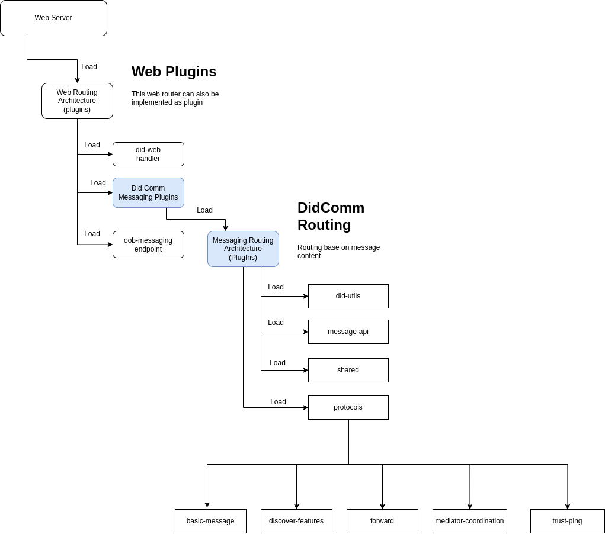

# **Architecture Documentation: Plugin-Based DIDComm Router**

## **1. Introduction**
### **1.1 Purpose**
This document provides an overview of the plugin-based architecture used in the **DIDComm Routing System**. It highlights the structure, flow, and advantages of using a plugin-to-plugin model for routing messages in a modular and extensible manner.

### **1.2 Scope**
The system is designed as a web-based plugin architecture that dynamically loads and manages **DIDComm messaging** and routing components.

## **2. Architecture Overview**
### **2.1 High-Level Structure**
The system consists of several plugin layers, each responsible for handling a specific part of the DIDComm routing process. 

#### **Main Components:**
1. **Web Server**:  
   - Loads **Web Plugins**, including the **Web Routing Architecture (Plugins)**.
   - Provides an entry point for routing DIDComm messages.

2. **Web Plugins**:  
   - Contains handlers like `did-endpoint`, `didcomm-messaging` and `oob-messaging endpoint` to process DIDComm messages.
   - Uses **Messaging Routing Architecture (Plugins)** to determine message handling flow.

3. **DIDComm Routing**:  
   - Routes messages based on content and metadata.
   - Loads utility and API plugins:
     - `did-utils`
     - `message-api`
     - `shared`
     - `protocols`
   - The `protocols` module further loads individual DIDComm protocols such as:
     - `basic-message`
     - `discover-features`
     - `forward`
     - `mediator-coordination`
     - `trust-ping`

### **2.2 Architecture Diagram**

## **3. Advantages of the Plugin-to-Plugin Architecture**
### **3.1 Modularity**
- Each feature (e.g., routing, message processing) is implemented as a separate plugin.
- Developers can extend or modify individual components without affecting others.

### **3.2 Extensibility**
- New DIDComm protocols or message handlers can be integrated as plugins without modifying the core system.
- Supports gradual feature upgrades and iterative improvements.

### **3.3 Scalability**
- The architecture allows dynamic loading and unloading of plugins, optimizing resource utilization.
- Can scale horizontally by deploying specific plugin instances as microservices.

### **3.4 Maintainability**
- Clear separation of concerns ensures that individual plugins can be debugged, updated, or replaced independently.
- Easier to test smaller, isolated components.

### **3.5 Flexibility**
- Supports multiple routing strategies and message-handling workflows.
- Enables configurable plugin loading based on deployment needs.

### **3.6 Security**
- Plugins operate in isolated scopes, reducing security risks from unintended interactions.
- Allows fine-grained access control and auditing at the plugin level.

