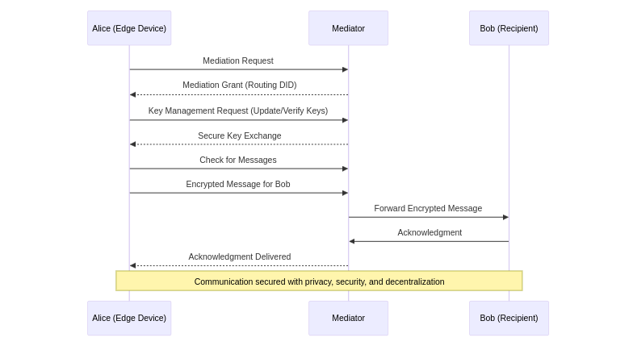

# DIDComm Messaging for Edge Device Registration and Message Exchange
## Introduction
With the growth of IoT and connected devices, secure, private communication between devices—like smart sensors, appliances, and any device has become essential. Decentralized Identifier Communication (DIDComm) provides a protocol that ensures private messaging, enabling devices to communicate without intermediaries directly accessing data. This makes DIDComm ideal for IoT networks where privacy, security, and decentralization are paramount.

### Benefits of DIDComm Messaging for Edge Devices
* **Enhanced Security:** Encryption protects message content, even when routed through intermediaries.
* **Privacy Preservation:** Only routing information is visible to intermediaries, keeping message content confidential.
* **Decentralization:** Devices control the communication flow without reliance on centralized systems.
* **Reliable Message Delivery:** Coordinated through a Mediator, communication remains effective even in complex networks.
This guide outlines the DIDComm messaging process, including participant roles, secure key exchange, and message flow, with an emphasis on privacy and security.

### Key Roles in DIDComm Messaging
 * **Mediator**
The Mediator facilitates message routing between devices, handling tasks such as forwarding, error management, and key updates. This support allows devices to connect securely, even in networks with limited reachability.

### Alice (Edge Device)
Alice is a device initiating communication with Bob. She first connects with the Mediator to obtain routing information, establishing a secure, private channel.

### Bob (Edge Device/Recipient)
Bob is the intended recipient of Alice’s messages. However, he can also initiate communication, allowing for dynamic role interchangeability between devices.

## DIDComm Messaging Phases
The DIDComm process has three main phases:

* **Phase 1: Establishing Mediation**
Alice registers with the Mediator to set up secure routing.

* **Mediation Request:** Alice requests mediation services for routing.
Mediation Grant: The Mediator grants the request, providing Alice with a routing identifier (DID) for secure messaging.
* **Phase 2: Message Exchange Preparation**
With mediation in place, Alice prepares to communicate securely:

* **Key Management:** Alice reviews and updates her encryption keys if needed.
Secure Key Exchange: Alice and the Mediator exchange public keys, establishing the foundation for encrypted communication.
* **Phase 3: Message Pickup and Delivery**
Alice and Bob exchange messages with the Mediator’s support:

 * **Message Pickup:** Alice periodically checks with the Mediator for incoming messages.
* **Message Creation and Delivery:** Alice encrypts a message for Bob, which the Mediator securely forwards without viewing its content.
* **Acknowledgment:** Bob decrypts and reads Alice’s message, then sends an acknowledgment back to confirm delivery.
### Security, Privacy, and Decentralization in DIDComm
DID
DIDComm supports role interchangeability, allowing devices to dynamically switch between sender and recipient roles. Privacy is maintained as the Mediator only unpacks routing information, keeping the actual message confidential.

### Conclusion
DIDComm messaging offers a robust framework for private, secure communication between devices. By coordinating through a Mediator, devices like Alice and Bob can connect reliably even in complex network setups.